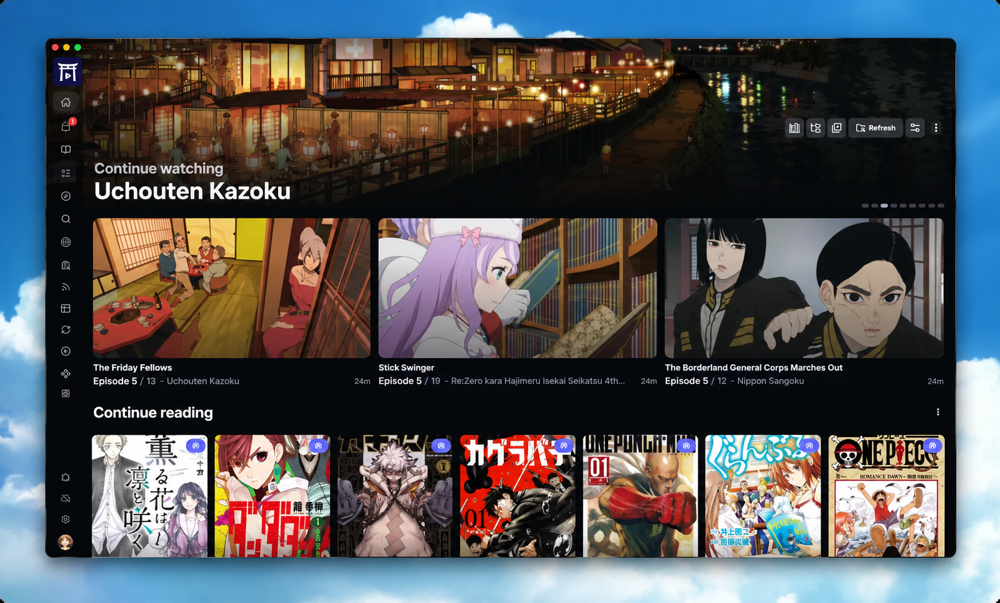

<h1 align="center"><b>Tori</b></h1>

  <a href="https://docs.toritv.com">Documentation</a> |
  <a href="https://github.com/yeonvvx/tori/releases">Latest release</a> |
  <a href="https://toritv.com">Copyright</a>

  
  
	
  

<h5 align="center">
Leave a star if you like the project! ⭐️
</h5>

## About

Tori is a **media server** with a **web interface** and **desktop app** for managing your local library, streaming anime and reading manga.

> [!IMPORTANT]
>Tori does not provide, host, or distribute any media content. Users are responsible for obtaining media through legal means and complying with their local laws. Extensions listed on the app are unaffiliated with Tori and may be removed if they violated copyright laws. </strong>

## Features

- **Cross-platform**: Web interface and desktop app for Windows, Linux, and macOS, companion and mobile server apps for iOS and Android
- **Tori Denshi**: Desktop client with built-in libmpv-based video player (support for SSA/ASS subtitles, shaders, and more)
- **Tori Tenji**: Companion app for iOS and Android to browse your library, manage your AniList, stream content, and enjoy offline access. Connect to your existing Tori server or host your own directly on your mobile device with the Mobile Server app
- **AniList Integration**: Browse and manage your lists, discover anime and manga
- **Custom Sources**: Support for adding non-AniList anime and manga series 
- **Library Management**: Fast and smart scanning of local files without strict naming conventions or folder structures
- **Torrent Integration**: Built-in torrent search engine via extensions and downloading support with qBittorrent, Transmission, Torbox, Real-Debrid, AllDebrid and Premiumize
- **Torrent Streaming**: Stream torrents directly to the media player without waiting for downloads (supports Bittorrent, Torbox, Real-Debrid, AllDebrid and Premiumize)
- **Online Streaming**: Watch anime from online sources directly within the app via extensions
- **Auto Downloader**: Automatically track and download new episodes with customizable filters and advanced features (prioritization, scoring, delay, etc.)
- **Extension Marketplace**: In-app repository to install and manage extensions for online streaming, manga sources, and torrent providers
- **Manga Reader**: Read chapters from your local library or via extensions with a unified interface
- **Transcoding & Direct Play**: Stream your library to any device web browser with on-the-fly transcoding or direct play
- **External Player Support**: Seamless integration with MPV, VLC, and MPC-HC on desktop
- **Mobile Player Integration**: Open files and streams in mobile players (Outplayer, VLC, etc.) via intents or deep links
- **Playlists**: Create and manage playlists for a seamless binge watching experience
- **Customizable UI**: Personalize the interface with color themes, background images, and layout options
- **Discord Rich Presence**: Display your watching activity automatically
- **Offline Mode**: Access your anime and manga library without an internet connection
- **Schedule**: Track upcoming releases and missed episodes

## Get started

Read the installation guide to set up Tori on your device.

<a href="https://docs.toritv.com" style="font-size:18px;" align="center">
How to install Tori
</a>

 

## Goal

This is a one-person project and may not meet every use case. If it doesn't fully fit your needs, other tools might be a better match.

### Not planned

- Built-in support for other trackers such as MyAnimeList, Trakt, SIMKL, etc.
- Built-in support for other media players
- Built-in localization (translations)

Consider sponsoring or sharing the project if you want to see more features implemented.

## Tech stack

* Server: [Go](https://go.dev/)
* Frontend: [React](https://reactjs.org/), [Rsbuild/Rspack](https://rsbuild.rs/), [Tanstack Router](https://tanstack.com/router)
* Tori Denshi: [Electron](https://www.electronjs.org/)

## Development and Build

Building from source is straightforward, you'll need [Node.js](https://nodejs.org/en/download) and [Go](https://go.dev/doc/install) installed on your system.
Development and testing might require additional configuration.

[Read more here](https://github.com/yeonvvx/tori/blob/main/DEVELOPMENT_AND_BUILD.md)

 

 

> [!NOTE]
> For copyright-related requests, please contact the maintainer using the contact information provided on [the website](https://toritv.com).
